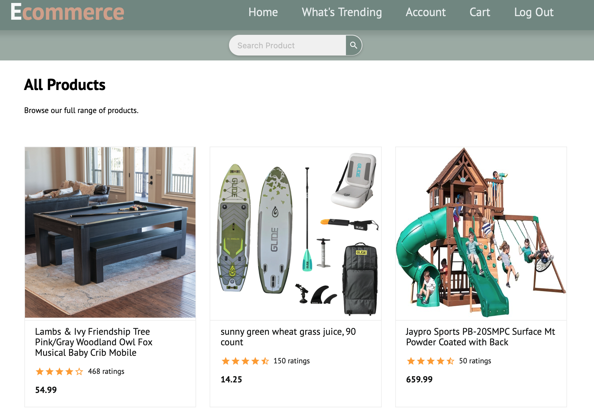
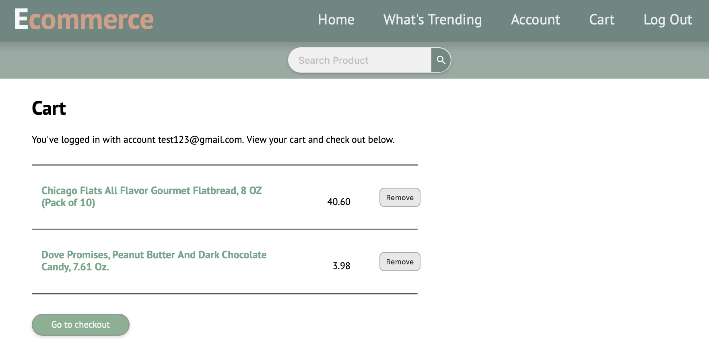

# Full-stack-E-commerce-Web-App 

Reconstruction on going...Stay tuned

## What to Expect

### 1. Backend - DB Model Update
This was the major cause for the underwhelming performance, even with Redis.

*<u>Before</u>*: inventory info is bound with product, write-heavy compared to product catalogs.

*<u>After</u>*: **Segregate inventory entity**, serving read-mostly product catalogs. Caching should be more effective now.

Check the updated Schema for more details!

### 2. Backend - Incorporate Message Queue for Order & Notification this time

This is a new technique this project try to apply this time, for simulating the peak-hour, write-heavy demands typical of real-world e-commerce platforms.

While far from handling millions of messages per second, this project will start from **RabbitMQ** for now to process tasks like order placement and inventory updates asynchronously, to ensure the app remains responsive as possible. 

Besides, with optimization in the data model and Redis caching, we expect further reduced read pressure directly on the database, ensuring better overall performance during traffic surges.

### 3. Fullstack - User Friendlier Feature - Address Management Section

*<u>Before</u>*: 
- No dedicated address management section, even for same address, the web app requires filling in every time (~~sounds unreasonable, I would cancel Target subscription for sure if they do so.~~)

*<u>After</u>*: 
- **Dedicated address management section** in /account summary page, with **enhanced validation** to avoid typo.

## Minor changes

The frontend will remain pretty much the same except for necessary component & functionality updates related to part I.

Great thanks to the **frontend references from Cmastris's ecommerce project**, which is an excellent source of cloning the Amazon Style Ecommerce Platform.

But this time, perhaps implement it in Morandi's style?

